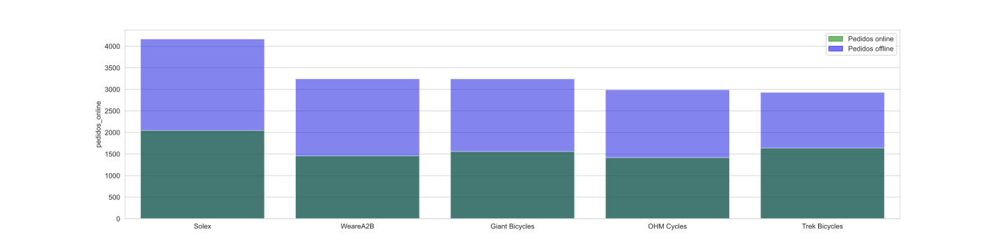

## Estudio de variables

### list_price
Es la variable **cuantitativa** que hace referencia al precio del producto adquirido. Ésta se comprende en un rando de entre 12.01 y 2091.47.

count | mean | std | min | 25% | 50% | 75% | max |
:----:|:------------:|:--------:|:-----:|:------:|:-------:|:-------:|:-------:|
19445 | 1107.337193  | 582.6624 | 12.01 | 575.27 | 1163.89 | 1635.30 | 2091.47 |

#### Precio por clase de producto

A continuación, se muestra la distribución del precio del conjunto de datos. Nótese que distribución normal y que, a su vez, está compuesta por otras distribuciones). En los siguientes gráficos, se observan distintas componentes, basadas en las clases de producto (product_class), que componen la distribución del precio.

Price             |  Price by product class
:-------------------------:|:-------------------------:
  |  

De la misma manera, se ha extraído las distintas componentes relacionadas con el tamaño del producto (product_size) de los elementos anteriores. También se observa que ninguna componente sigue una distribución normal, además de que no componen 3 grupos distinguidos.

Realizando un test de las medias de precio de producto por clase, se obtiene el siguiente resultado:
- Estadístico: 180.00865523079634
- p-valor: 3.4533480856070333e-78

#### Precio por clase de producto y tamaño

##### Productos de la misma clase con distinto tamaño

- **Clase baja**
- Estadístico: 5.718485684777187
- p-valor: 1.1841388434092325e-08

- **Clase mediana**
- Estadístico: 1605.0992524574058
- p-valor: 0.0

- **Clase alta**
- Estadístico: 434.1296627906751
- p-valor: 5.528692640792395e-166

##### p-valor de productos del mismo tamaño con distinta clase

- **Pequeños**
- Estadístico: 369.6347230319062
- p-valor: 4.800140843515247e-143

- **Medianos**
- Estadístico: 26.046975445006176
- p-valor: 5.14000726165566e-12

- **Grandes**
- Estadístico: 29.068346771113216
- p-valor: 2.566556221510514e-168

##### p-valor combinatorio

Aplicando el t-test para todos los pares de subsets (exceptuando los que son iguales y el subconjunto inexistente de productos grandes de clase baja), se obtiene la siguiente tabla:

<table border="1" class="dataframe">
  <thead>
    <tr style="text-align: right;">
      <th></th>
      <th>Class 1</th>
      <th>Size 1</th>
      <th>Class 2</th>
      <th>Size 2</th>
      <th>Statistic</th>
      <th>p-value</th>
    </tr>
  </thead>
  <tbody>
    <tr>
      <th>32</th>
      <td>low</td>
      <td>small</td>
      <td>high</td>
      <td>medium</td>
      <td>-0.439619</td>
      <td>0.660</td>
    </tr>
    <tr>
      <th>39</th>
      <td>high</td>
      <td>medium</td>
      <td>low</td>
      <td>small</td>
      <td>0.439619</td>
      <td>0.660</td>
    </tr>
    <tr>
      <th>26</th>
      <td>low</td>
      <td>medium</td>
      <td>high</td>
      <td>large</td>
      <td>1.367159</td>
      <td>0.172</td>
    </tr>
    <tr>
      <th>45</th>
      <td>high</td>
      <td>large</td>
      <td>low</td>
      <td>medium</td>
      <td>-1.367159</td>
      <td>0.172</td>
    </tr>
    <tr>
      <th>28</th>
      <td>low</td>
      <td>small</td>
      <td>medium</td>
      <td>medium</td>
      <td>2.236733</td>
      <td>0.025</td>
    </tr>
    <tr>
      <th>3</th>
      <td>medium</td>
      <td>medium</td>
      <td>low</td>
      <td>small</td>
      <td>-2.236733</td>
      <td>0.025</td>
    </tr>
    <tr>
      <th>42</th>
      <td>high</td>
      <td>large</td>
      <td>medium</td>
      <td>medium</td>
      <td>-3.754626</td>
      <td>1.747e-04</td>
    </tr>
    <tr>
      <th>5</th>
      <td>medium</td>
      <td>medium</td>
      <td>high</td>
      <td>large</td>
      <td>3.754626</td>
      <td>1.747e-04</td>
    </tr>
    <tr>
      <th>33</th>
      <td>low</td>
      <td>small</td>
      <td>high</td>
      <td>large</td>
      <td>4.175018</td>
      <td>3.182e-05</td>
    </tr>
    <tr>
      <th>46</th>
      <td>high</td>
      <td>large</td>
      <td>low</td>
      <td>small</td>
      <td>-4.175018</td>
      <td>3.182e-05</td>
    </tr>
    <tr>
      <th>4</th>
      <td>medium</td>
      <td>medium</td>
      <td>high</td>
      <td>medium</td>
      <td>-4.247274</td>
      <td>2.182e-05</td>
    </tr>
    <tr>
      <th>35</th>
      <td>high</td>
      <td>medium</td>
      <td>medium</td>
      <td>medium</td>
      <td>4.247274</td>
      <td>2.182e-05</td>
    </tr>
    <tr>
      <th>2</th>
      <td>medium</td>
      <td>medium</td>
      <td>low</td>
      <td>medium</td>
      <td>4.682813</td>
      <td>2.864e-06</td>
    </tr>
    <tr>
      <th>21</th>
      <td>low</td>
      <td>medium</td>
      <td>medium</td>
      <td>medium</td>
      <td>-4.682813</td>
      <td>2.864e-06</td>
    </tr>
    <tr>
      <th>31</th>
      <td>low</td>
      <td>small</td>
      <td>low</td>
      <td>medium</td>
      <td>5.718486</td>
      <td>1.184e-08</td>
    </tr>
    <tr>
      <th>24</th>
      <td>low</td>
      <td>medium</td>
      <td>low</td>
      <td>small</td>
      <td>-5.718486</td>
      <td>1.184e-08</td>
    </tr>
    <tr>
      <th>47</th>
      <td>high</td>
      <td>large</td>
      <td>high</td>
      <td>medium</td>
      <td>-5.722584</td>
      <td>1.170e-08</td>
    </tr>
    <tr>
      <th>40</th>
      <td>high</td>
      <td>medium</td>
      <td>high</td>
      <td>large</td>
      <td>5.722584</td>
      <td>1.170e-08</td>
    </tr>
    <tr>
      <th>38</th>
      <td>high</td>
      <td>medium</td>
      <td>low</td>
      <td>medium</td>
      <td>8.288674</td>
      <td>1.523e-16</td>
    </tr>
    <tr>
      <th>25</th>
      <td>low</td>
      <td>medium</td>
      <td>high</td>
      <td>medium</td>
      <td>-8.288674</td>
      <td>1.523e-16</td>
    </tr>
    <tr>
      <th>50</th>
      <td>high</td>
      <td>small</td>
      <td>medium</td>
      <td>large</td>
      <td>9.701996</td>
      <td>5.395e-22</td>
    </tr>
    <tr>
      <th>13</th>
      <td>medium</td>
      <td>large</td>
      <td>high</td>
      <td>small</td>
      <td>-9.701996</td>
      <td>5.395e-22</td>
    </tr>
    <tr>
      <th>30</th>
      <td>low</td>
      <td>small</td>
      <td>medium</td>
      <td>small</td>
      <td>-11.657978</td>
      <td>1.365e-30</td>
    </tr>
    <tr>
      <th>17</th>
      <td>medium</td>
      <td>small</td>
      <td>low</td>
      <td>small</td>
      <td>11.657978</td>
      <td>1.365e-30</td>
    </tr>
    <tr>
      <th>19</th>
      <td>medium</td>
      <td>small</td>
      <td>high</td>
      <td>large</td>
      <td>14.172834</td>
      <td>9.400e-44</td>
    </tr>
    <tr>
      <th>44</th>
      <td>high</td>
      <td>large</td>
      <td>medium</td>
      <td>small</td>
      <td>-14.172834</td>
      <td>9.400e-44</td>
    </tr>
    <tr>
      <th>18</th>
      <td>medium</td>
      <td>small</td>
      <td>high</td>
      <td>medium</td>
      <td>15.204312</td>
      <td>1.079e-50</td>
    </tr>
    <tr>
      <th>37</th>
      <td>high</td>
      <td>medium</td>
      <td>medium</td>
      <td>small</td>
      <td>-15.204312</td>
      <td>1.079e-50</td>
    </tr>
    <tr>
      <th>20</th>
      <td>medium</td>
      <td>small</td>
      <td>high</td>
      <td>small</td>
      <td>-20.437005</td>
      <td>1.041e-84</td>
    </tr>
    <tr>
      <th>51</th>
      <td>high</td>
      <td>small</td>
      <td>medium</td>
      <td>small</td>
      <td>20.437005</td>
      <td>1.041e-84</td>
    </tr>
    <tr>
      <th>15</th>
      <td>medium</td>
      <td>small</td>
      <td>medium</td>
      <td>large</td>
      <td>-20.589639</td>
      <td>1.666e-90</td>
    </tr>
    <tr>
      <th>8</th>
      <td>medium</td>
      <td>large</td>
      <td>medium</td>
      <td>small</td>
      <td>20.589639</td>
      <td>1.666e-90</td>
    </tr>
    <tr>
      <th>1</th>
      <td>medium</td>
      <td>medium</td>
      <td>medium</td>
      <td>small</td>
      <td>-20.954369</td>
      <td>1.689e-95</td>
    </tr>
    <tr>
      <th>14</th>
      <td>medium</td>
      <td>small</td>
      <td>medium</td>
      <td>medium</td>
      <td>20.954369</td>
      <td>1.689e-95</td>
    </tr>
    <tr>
      <th>48</th>
      <td>high</td>
      <td>large</td>
      <td>high</td>
      <td>small</td>
      <td>-24.076130</td>
      <td>4.801e-100</td>
    </tr>
    <tr>
      <th>55</th>
      <td>high</td>
      <td>small</td>
      <td>high</td>
      <td>large</td>
      <td>24.076130</td>
      <td>4.801e-100</td>
    </tr>
    <tr>
      <th>23</th>
      <td>low</td>
      <td>medium</td>
      <td>medium</td>
      <td>small</td>
      <td>-24.109789</td>
      <td>7.811e-120</td>
    </tr>
    <tr>
      <th>16</th>
      <td>medium</td>
      <td>small</td>
      <td>low</td>
      <td>medium</td>
      <td>24.109789</td>
      <td>7.811e-120</td>
    </tr>
    <tr>
      <th>29</th>
      <td>low</td>
      <td>small</td>
      <td>medium</td>
      <td>large</td>
      <td>-28.283912</td>
      <td>1.013e-160</td>
    </tr>
    <tr>
      <th>10</th>
      <td>medium</td>
      <td>large</td>
      <td>low</td>
      <td>small</td>
      <td>28.283912</td>
      <td>1.013e-160</td>
    </tr>
    <tr>
      <th>43</th>
      <td>high</td>
      <td>large</td>
      <td>medium</td>
      <td>large</td>
      <td>-29.068347</td>
      <td>2.567e-168</td>
    </tr>
    <tr>
      <th>12</th>
      <td>medium</td>
      <td>large</td>
      <td>high</td>
      <td>large</td>
      <td>29.068347</td>
      <td>2.567e-168</td>
    </tr>
    <tr>
      <th>34</th>
      <td>low</td>
      <td>small</td>
      <td>high</td>
      <td>small</td>
      <td>-33.806683</td>
      <td>3.268e-171</td>
    </tr>
    <tr>
      <th>53</th>
      <td>high</td>
      <td>small</td>
      <td>low</td>
      <td>small</td>
      <td>33.806683</td>
      <td>3.268e-171</td>
    </tr>
    <tr>
      <th>41</th>
      <td>high</td>
      <td>medium</td>
      <td>high</td>
      <td>small</td>
      <td>-31.532222</td>
      <td>1.111e-182</td>
    </tr>
    <tr>
      <th>54</th>
      <td>high</td>
      <td>small</td>
      <td>high</td>
      <td>medium</td>
      <td>31.532222</td>
      <td>1.111e-182</td>
    </tr>
    <tr>
      <th>6</th>
      <td>medium</td>
      <td>medium</td>
      <td>high</td>
      <td>small</td>
      <td>-29.513785</td>
      <td>9.499e-183</td>
    </tr>
    <tr>
      <th>49</th>
      <td>high</td>
      <td>small</td>
      <td>medium</td>
      <td>medium</td>
      <td>29.513785</td>
      <td>9.499e-183</td>
    </tr>
    <tr>
      <th>27</th>
      <td>low</td>
      <td>medium</td>
      <td>high</td>
      <td>small</td>
      <td>-40.209588</td>
      <td>1.368e-274</td>
    </tr>
    <tr>
      <th>52</th>
      <td>high</td>
      <td>small</td>
      <td>low</td>
      <td>medium</td>
      <td>40.209588</td>
      <td>1.368e-274</td>
    </tr>
    <tr>
      <th>36</th>
      <td>high</td>
      <td>medium</td>
      <td>medium</td>
      <td>large</td>
      <td>-40.371289</td>
      <td>0.000e+00</td>
    </tr>
    <tr>
      <th>11</th>
      <td>medium</td>
      <td>large</td>
      <td>high</td>
      <td>medium</td>
      <td>40.371289</td>
      <td>0.000e+00</td>
    </tr>
    <tr>
      <th>7</th>
      <td>medium</td>
      <td>large</td>
      <td>medium</td>
      <td>medium</td>
      <td>55.497811</td>
      <td>0.000e+00</td>
    </tr>
    <tr>
      <th>9</th>
      <td>medium</td>
      <td>large</td>
      <td>low</td>
      <td>medium</td>
      <td>52.286502</td>
      <td>0.000e+00</td>
    </tr>
    <tr>
      <th>22</th>
      <td>low</td>
      <td>medium</td>
      <td>medium</td>
      <td>large</td>
      <td>-52.286502</td>
      <td>0.000e+00</td>
    </tr>
    <tr>
      <th>0</th>
      <td>medium</td>
      <td>medium</td>
      <td>medium</td>
      <td>large</td>
      <td>-55.497811</td>
      <td>0.000e+00</td>
    </tr>
  </tbody>
</table>

Como se observa, para las cuatro primeras comparaciones, no existe evidencia suficiente como para afirmar que sus medias son iguales con un intervalo de confianza 95%.

En las siguientes representaciones, se puede comparar con mayor facilidad los precios de los productos de distintas clases y tamaños.

Price by product class and product size |
:-------------------------:|
|

A simple vista, por ejemplo, se puede averiguar que:
- la totalidad de los productos pequeños y de clase alta son más caros que todos los medianos.
- el rango de precios de los productos grandes y de clase alta es bastante amplio.
- los precios de todos los productos de un mismo tamaño se solapan excepto en los pequeños (pudiendo ser susceptible de formar tres grupos distinguidos).

### brand
Es la variable **cualitativa** referida a las marcas de los productos.

De acuerdo con la tabla, se pueden extraer la siguiente información que, por ejemplo, puede ayudar en la gestión de stock (tanto en tiendas como en almacenes) como en la estrategia de digitalización de la compañía:
- Solex es la marca más vendida.
- La mitad de los pedidos se realizan online.
- Los pedidos cancelados totales son inferiores al 1% del total de pedidos, con una media de precio por artículo de 1138.15.
  - Se puede afirmar que es semejante a la media de pedidos totales tras un t-test de ambas.

<table border="1" class="dataframe">
  <thead>
    <tr style="text-align: right;">
      <th></th>
      <th>frecuencia</th>
      <th>frecuencia_relativa</th>
      <th>pedidos_online</th>
      <th>%_online</th>
      <th>pedidos_aprob</th>
      <th>pedidos_cancel</th>
      <th>%_cancelados</th>
    </tr>
  </thead>
  <tbody>
    <tr>
      <th>Solex</th>
      <td>4169</td>
      <td>0.214400</td>
      <td>2047</td>
      <td>49.100504</td>
      <td>4128</td>
      <td>41</td>
      <td>0.983449</td>
    </tr>
    <tr>
      <th>WeareA2B</th>
      <td>3245</td>
      <td>0.166881</td>
      <td>1460</td>
      <td>44.992296</td>
      <td>2906</td>
      <td>25</td>
      <td>0.770416</td>
    </tr>
    <tr>
      <th>Giant Bicycles</th>
      <td>3244</td>
      <td>0.166830</td>
      <td>1560</td>
      <td>48.088779</td>
      <td>2967</td>
      <td>26</td>
      <td>0.801480</td>
    </tr>
    <tr>
      <th>OHM Cycles</th>
      <td>2993</td>
      <td>0.153921</td>
      <td>1417</td>
      <td>47.343802</td>
      <td>2840</td>
      <td>23</td>
      <td>0.768460</td>
    </tr>
    <tr>
      <th>Trek Bicycles</th>
      <td>2931</td>
      <td>0.150733</td>
      <td>1640</td>
      <td>55.953599</td>
      <td>3217</td>
      <td>27</td>
      <td>0.921187</td>
    </tr>
    <tr>
      <th>Norco Bicycles</th>
      <td>2863</td>
      <td>0.147236</td>
      <td>1615</td>
      <td>56.409361</td>
      <td>3215</td>
      <td>30</td>
      <td>1.047852</td>
    </tr>
    <tr>
      <th>Total</th>
      <td>19445</td>
      <td>1.000000</td>
      <td>9739</td>
      <td>50.084855</td>
      <td>19273</td>
      <td>172</td>
      <td>0.884546</td>
    </tr>
  </tbody>
</table>

